# Лабораторная работа №7

## Преобразование и анализ кода с использованием Clang и LLVM

Выполнила: Базыкина Диана Александровна, группа АП-326.

Индивидуальный вариант 2.6: Форматирование / парсинг научной нотации.

Дата выполнения: 23 сентября 2026 года.

## Цель и условия выполнения

Получить абстрактное синтаксическое дерево и LLVM IR программ на C, исследовать оптимизацию O2, построить графы потока управления и определить, как компилятор обрабатывает вызов strtod с известной строкой.

| Компонент | Фактическая среда |
| --- | --- |
| ОС | Ubuntu 26.04.1 LTS, x86_64, VirtualBox |
| Clang и LLVM / opt | 21.1.8 |
| Graphviz | 14.1.2 |
| Библиотека C | glibc 2.43 |
| Рабочая папка | /home/vboxuser/lab7 |


## Установка и проверка инструментов

```text
sudo apt-get update
sudo apt-get install -y clang llvm llvm-dev graphviz build-essential
clang --version
opt --version
dot -V
```

Clang и opt использованы из каталога /usr/lib/llvm-21/bin. Для запуска проходов opt применяется запись -passes.

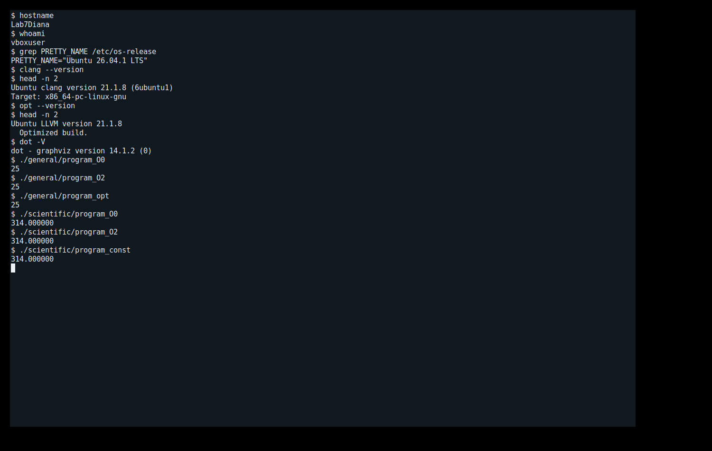

## 1. Общая часть: исходный код и AST

```text
#include <stdio.h>

int square(int x) {
    return x * x;
}

int main() {
    int a = 5;
    int b = square(a);
    printf("%d\n", b);
    return 0;
}
```

```text
clang -O0 main.c -o program_O0
./program_O0
# Вывод: 25
clang -Xclang -ast-dump -fsyntax-only main.c > ast_full.txt
clang -Xclang -ast-dump -Xclang -ast-dump-filter=square \
  -fsyntax-only main.c > ast_square.txt
```

AST функции square приведено ниже. Для компактности адреса объектов Clang заменены на <id>; полный неизменённый вывод находится в general/ast_square.txt.

```text
Dumping square:
FunctionDecl <id> <main.c:3:1, line:5:1> line:3:5 used square 'int (int)'
|-ParmVarDecl <id> <col:12, col:16> col:16 used x 'int'
`-CompoundStmt <id> <col:19, line:5:1>
  `-ReturnStmt <id> <line:4:5, col:16>
    `-BinaryOperator <id> <col:12, col:16> 'int' '*'
      |-ImplicitCastExpr <id> <col:12> 'int' <LValueToRValue>
      | `-DeclRefExpr <id> <col:12> 'int' lvalue ParmVar <id> 'x' 'int'
      `-ImplicitCastExpr <id> <col:16> 'int' <LValueToRValue>
        `-DeclRefExpr <id> <col:16> 'int' lvalue ParmVar <id> 'x' 'int'
```

FunctionDecl описывает функцию square с результатом int, ParmVarDecl - параметр x. В ReturnStmt находится BinaryOperator со знаком *. Два DeclRefExpr ссылаются на один параметр; преобразования LValueToRValue читают его значение. В AST main присутствуют объявления a и b, CallExpr для square и printf. Полное дерево main сохранено отдельно.

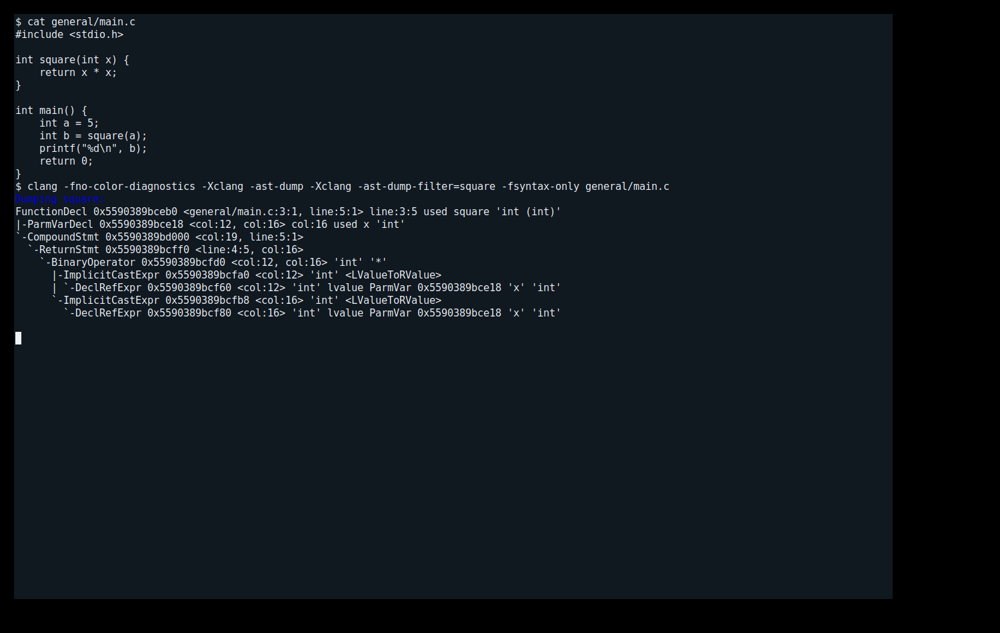

## 1.1. LLVM IR и оптимизация общей программы

```text
clang -O0 -S -emit-llvm main.c -o O0.ll
clang -O2 -S -emit-llvm main.c -o O2.ll
diff -u O0.ll O2.ll > comparison.diff
```

Функция main без оптимизаций:

```text
define dso_local i32 @main() #0 {
  %1 = alloca i32, align 4
  %2 = alloca i32, align 4
  %3 = alloca i32, align 4
  store i32 0, ptr %1, align 4
  store i32 5, ptr %2, align 4
  %4 = load i32, ptr %2, align 4
  %5 = call i32 @square(i32 noundef %4)
  store i32 %5, ptr %3, align 4
  %6 = load i32, ptr %3, align 4
  %7 = call i32 (ptr, ...) @printf(ptr noundef @.str, i32 noundef %6)
  ret i32 0
}
```

Функция main после O2:

```text
define dso_local noundef i32 @main() local_unnamed_addr #1 {
  %1 = tail call i32 (ptr, ...) @printf(ptr noundef nonnull dereferenceable(1) @.str, i32 noundef 25)
  ret i32 0
}
```

| Инструкции в main | O0 | O2 |
| --- | --- | --- |
| alloca / load / store | 3 / 2 / 3 | 0 / 0 / 0 |
| Вызовы | square, printf | printf |
| Вывод программы | 25 | 25 |

Вызов square(5) устранён, в printf передаётся константа 25. Локальные ячейки памяти main удалены. Отдельное определение square при этом сохранилось: у функции внешнее связывание. Поэтому утверждение о полном исчезновении square из примера методички не соответствует этому запуску. Сама square после O2 вычисляет произведение аргумента через mul.

LLVM IR уже использует SSA-значения при O0. Оптимизация устраняет часть обращений к памяти; формулировка «IR впервые стал SSA после O2» была бы неточной.

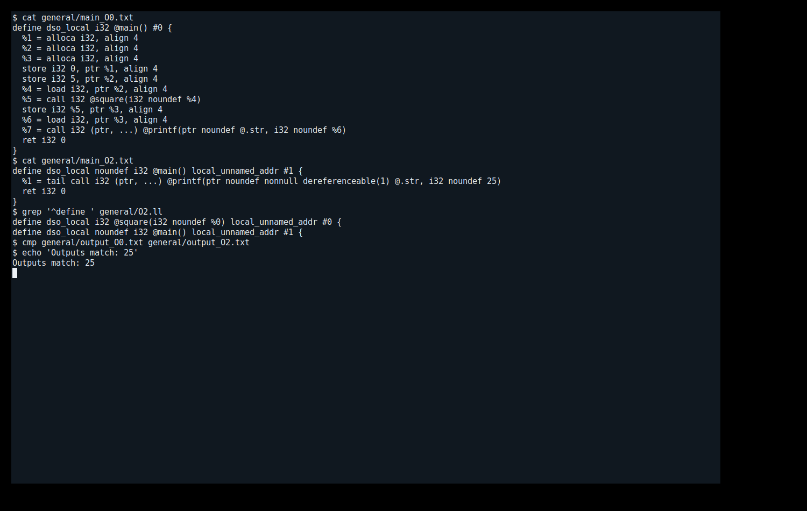

## 1.2. Проходы opt и графы потока управления

```text
clang -O2 -Xclang -disable-llvm-passes -S -emit-llvm \
  main.c -o before_opt.ll
opt -S -passes="default<O2>" before_opt.ll -o opt_O2.ll
clang opt_O2.ll -o program_opt
./program_opt
# Вывод: 25
```

Для отдельного эксперимента opt вход сформирован с отключёнными LLVM-проходами, но с настройками фронтенда O2. Это не тот же файл, что обычный O0. После opt вызов square в main отсутствует; выполнение даёт 25. Проверка LLVM verifier пройдена.

```text
opt -passes=dot-cfg -disable-output ../O2.ll
dot -Tpng .main.dot -o main.png
dot -Tpng .square.dot -o square.png
```


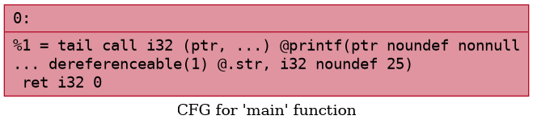

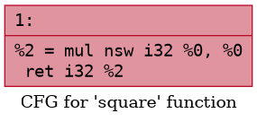

Каждая показанная функция содержит один базовый блок без ветвлений. Вызов функции не является ребром внутрипроцедурного CFG. 

## 2. Вариант 2.6: научная нотация

```text
#include <stdio.h>
#include <stdlib.h>

int main() {
    const char* str = "3.14e2";
    double value = strtod(str, NULL);
    printf("%f\n", value);
    return 0;
}
```

Строка 3.14e2 задаёт 3.14 × 10² = 314. Функция strtod преобразует текст в double. NULL означает, что адрес первого непрочитанного символа не запрашивается. printf с %f форматирует значение с шестью цифрами после десятичной точки.

```text
clang -O0 scientific.c -o program_O0
./program_O0
# Вывод: 314.000000
clang -Xclang -ast-dump -Xclang -ast-dump-filter=main \
  -fsyntax-only scientific.c > ast_main.txt
```

Ключевые узлы фактического AST (выборка; идентификаторы адресов сокращены):

```text
FunctionDecl <id> <scientific.c:4:1, line:9:1> line:4:5 main 'int ()'
  | `-VarDecl <id> <col:5, col:23> col:17 used str 'const char *' cinit
  |       `-StringLiteral <id> <col:23> 'char[7]' lvalue "3.14e2"
  | `-VarDecl <id> <col:5, col:36> col:12 used value 'double' cinit
  |   `-CallExpr <id> <col:20, col:36> 'double'
  |     | `-DeclRefExpr <id> <col:20> 'double (const char *, char **)' Function <id> 'strtod' 'double (const char *, char **)'
  |-CallExpr <id> <scientific.c:7:5, col:25> 'int'
  | | `-DeclRefExpr <id> <col:5> 'int (const char *, ...)' Function <id> 'printf' 'int (const char *, ...)'
  | |   `-StringLiteral <id> <col:12> 'char[4]' lvalue "%f\n"
  `-ReturnStmt <id> <line:8:5, col:12>
```

Строка представлена StringLiteral типа char[7]: шесть символов и завершающий ноль. Переменная str имеет тип const char *, value - double. Вызов strtod является CallExpr с результатом double. Сам текст 3.14e2 внутри строки не является числовым литералом C и не вычисляется фронтендом как выражение 3.14 × 100.

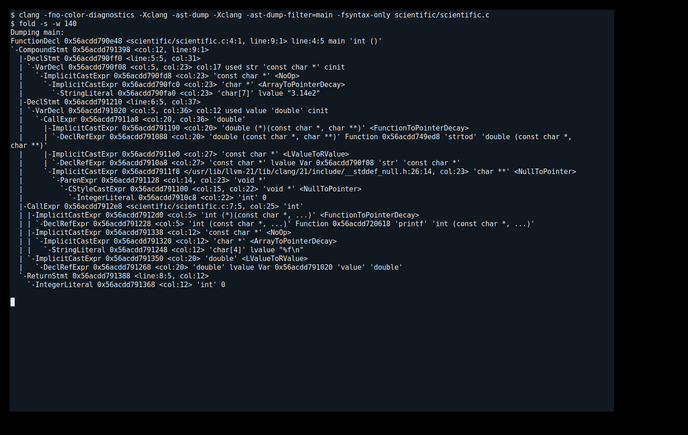

## 2.1. Сравнение IR и сохранение strtod

```text
clang -O0 -S -emit-llvm scientific.c -o O0.ll
clang -O2 -S -emit-llvm scientific.c -o O2.ll
grep -nE "call.*@strtod" main_O2.txt
```

main без оптимизаций:

```text
define dso_local i32 @main() #0 {
  %1 = alloca i32, align 4
  %2 = alloca ptr, align 8
  %3 = alloca double, align 8
  store i32 0, ptr %1, align 4
  store ptr @.str, ptr %2, align 8
  %4 = load ptr, ptr %2, align 8
  %5 = call double @strtod(ptr noundef %4, ptr noundef null) #3
  store double %5, ptr %3, align 8
  %6 = load double, ptr %3, align 8
  %7 = call i32 (ptr, ...) @printf(ptr noundef @.str.1, double noundef %6)
  ret i32 0
}
```

main после O2:

```text
define dso_local noundef i32 @main() local_unnamed_addr #0 {
  %1 = tail call double @strtod(ptr noundef nonnull captures(none) @.str, ptr noundef null) #3
  %2 = tail call i32 (ptr, ...) @printf(ptr noundef nonnull dereferenceable(1) @.str.1, double noundef %1)
  ret i32 0
}
```

| Инструкции в main | O0 | O2 |
| --- | --- | --- |
| alloca / load / store | 3 / 2 / 3 | 0 / 0 / 0 |
| Вызовы | strtod, printf | strtod, printf |
| Вывод | 314.000000 | 314.000000 |

В O2 остался реальный вызов @strtod, а не только объявление функции. Значение %1, возвращённое strtod, передаётся в printf. Следовательно, в данном запуске парсинг не встроен и не заменён константой. В ассемблере scientific_O2.s также сохранён вызов strtod. Оптимизатор устранил локальные ячейки и промежуточные загрузки/сохранения.

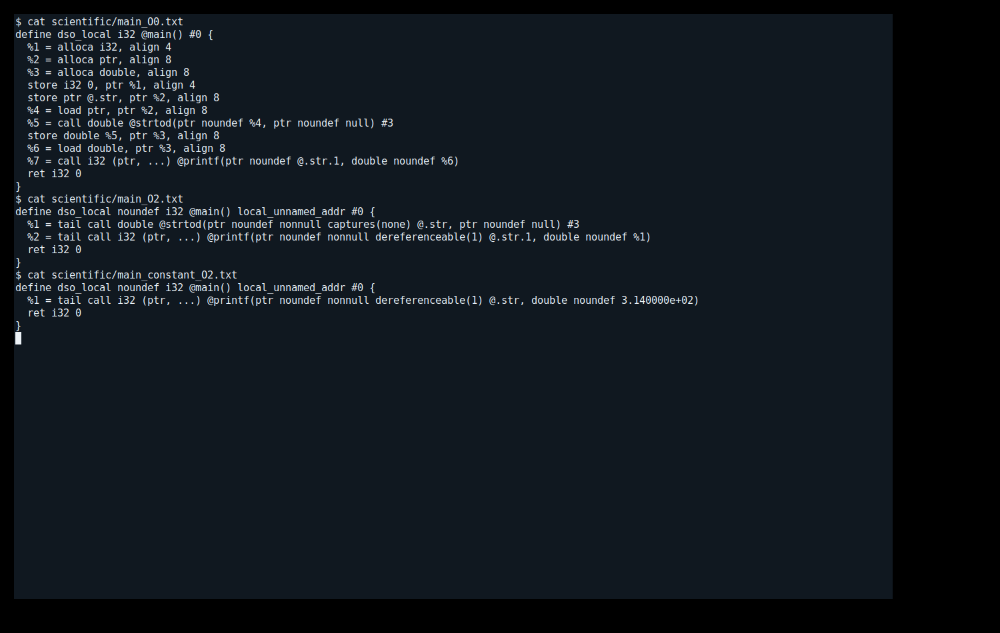

## 2.2. Эксперимент с заменой на константу

```text
#include <stdio.h>

int main() {
    double value = 314.0;
    printf("%f\n", value);
    return 0;
}
```

```text
clang -O2 scientific_const.c -o program_const
./program_const
# Вывод: 314.000000
clang -O2 -S -emit-llvm scientific_const.c -o constant_O2.ll
cmp output_O2.txt output_const.txt
```

IR функции main в изменённой программе:

```text
define dso_local noundef i32 @main() local_unnamed_addr #0 {
  %1 = tail call i32 (ptr, ...) @printf(ptr noundef nonnull dereferenceable(1) @.str, double noundef 3.140000e+02)
  ret i32 0
}
```

Вызова strtod больше нет; printf получает double 3.140000e+02 непосредственно. Это результат ручной замены исходного кода, а не доказательство автоматического свёртывания strtod компилятором.

Дополнительная проверка check_value.c сравнивает значения напрямую, выводит их в точной шестнадцатеричной форме и проверяет конец строки и errno:

```text
locale=C
parsed=0x1.3ap+8 constant=0x1.3ap+8 equal=1
consumed=6 tail_empty=1 errno=0
```

Для данного примера в начальной C-локали оба значения точно равны 314; вся строка прочитана, ошибки нет. Число 314 точно представимо в double. Вывод всех трёх программ совпал побайтово.

В общем случае заменять strtod лишь по наличию известной строки нельзя без анализа условий. Разбор зависит от локали и режима округления; возможны ошибки диапазона и изменение errno, а endptr может быть наблюдаемым результатом. В исходном примере setlocale не вызывается, endptr равен NULL, число невелико и точно представимо. Эксперимент подтверждает замену для проверенного случая, а не универсальное правило для библиотечного парсинга.

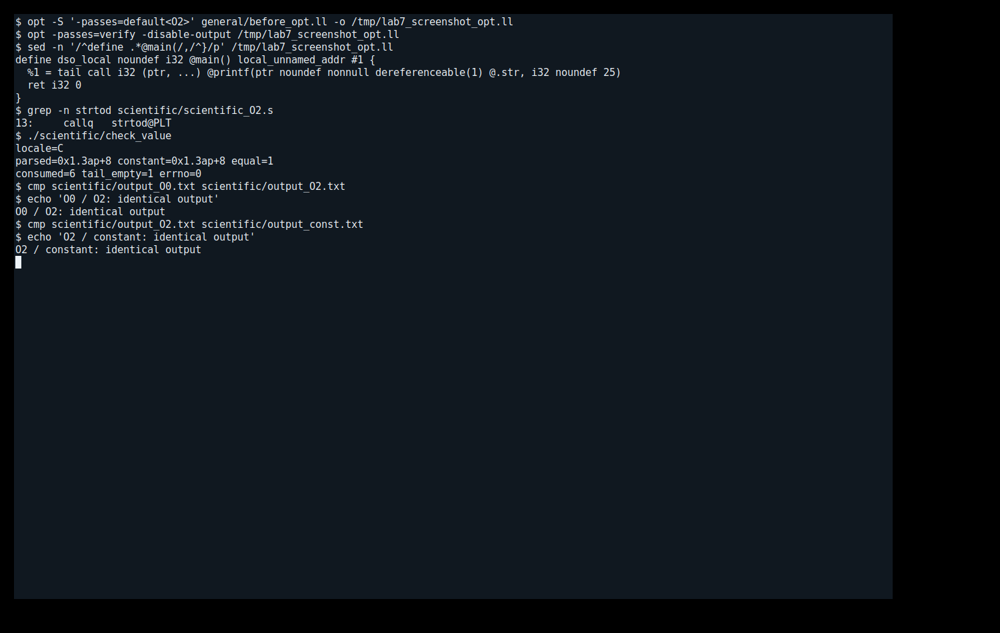

## 2.3. CFG и выводы по варианту

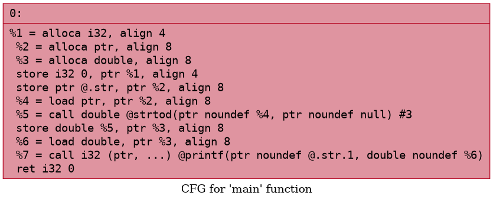

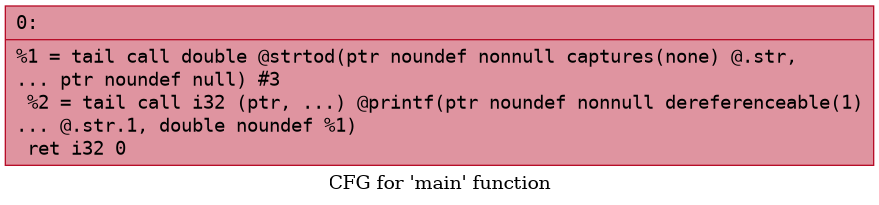

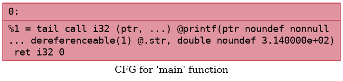

Во всех трёх случаях main состоит из одного базового блока, переходов между блоками нет. Упрощение инструкций не изменило структуру CFG. Внутреннее управление strtod не отображается в CFG main, так как библиотечная функция вызывается отдельно.

Вывод: Clang сохраняет синтаксические конструкции в AST и преобразует их в IR. LLVM при O2 упрощает локальные операции, но в проверенной сборке не вычисляет strtod("3.14e2", NULL) на этапе компиляции. Ручная подстановка 314.0 устраняет библиотечный разбор; её корректность требует проверки семантики конкретного случая.

## 3. Контрольные вопросы 1-6

1. Что такое Clang и какова его роль в компиляции?

Clang - фронтенд для C, C++ и ряда других языков. Он выполняет лексический, синтаксический и семантический анализ, строит AST и генерирует LLVM IR. Драйвер clang также организует последующие этапы компиляции и компоновки.

2. Что представляет собой LLVM?

LLVM - инфраструктура компиляторов с промежуточным представлением, анализами, оптимизационными проходами и генераторами кода для разных архитектур. Разные фронтенды могут использовать общие оптимизации и машинные бэкенды.

3. Чем AST отличается от LLVM IR?

AST близко к исходному языку: содержит объявления, типы, выражения и операторы. IR выражает вычисления через типизированные инструкции, значения, базовые блоки и переходы. Высокоуровневые конструкции при понижении могут исчезать.

4. Для чего необходимо IR?

IR отделяет особенности исходного языка от целевой архитектуры. Оно даёт унифицированную форму для анализа зависимостей, оптимизаций и последующей генерации машинного кода.

5. Что делает инструкция alloc?

В вопросе методички подразумевается alloca. Она выделяет память в контексте текущего вызова функции, обычно на стеке; память освобождается при возврате из функции. В исследованном O0 так представлены локальные переменные. При допустимости анализа эти ячейки могут быть устранены.

6. Зачем нужна оптимизация и каковы её цели?

Оптимизация преобразует код с сохранением требуемой семантики. Цели - повышение скорости, уменьшение размера программы и расхода ресурсов. Между целями возможны компромиссы; O2 не означает гарантированное ускорение каждого отдельного примера.

## 3. Контрольные вопросы 7-12

7. Что такое SSA-форма?

В SSA каждое SSA-значение определяется один раз. На слиянии путей инструкция phi может выбрать значение в зависимости от предшественника. Это упрощает анализ зависимостей и распространение констант. LLVM IR использует SSA и при O0, хотя чтения и записи памяти могут оставаться.

8. Что такое CFG и чем он полезен?

CFG - ориентированный граф, где узлы являются базовыми блоками, а рёбра - возможными переходами управления. Он помогает анализировать достижимость, циклы, доминирование и допустимость перемещений инструкций. В этой работе функции прямолинейны и имеют по одному блоку.

9. Как представлена арифметика в IR?

Для целых используются, например, add, sub и mul; для чисел с плавающей точкой - fadd, fsub и fmul. Инструкции указывают типы операндов. После O2 функция square содержит mul i32, а вычисление square(5) в main заменено константой.

10. Почему функции - отдельные единицы анализа?

Функция имеет собственный CFG, аргументы и локальные значения; многие анализы удобно ограничить её телом. Однако LLVM также выполняет межпроцедурные преобразования, например встраивание и анализ свойств функций.

11. Что происходит с короткой функцией, вызываемой один раз?

Оптимизатор может встроить её тело в место вызова, если это допустимо и выгодно. Единственный вызов и малый размер не гарантируют встраивания. Удаление определения - отдельное решение: в нашей программе вызов square исчез, но внешне доступное определение осталось.

12. Чем IR и CFG лучше исходного текста для оптимизаций?

Они явно задают типы, операции, зависимости значений и пути выполнения, без неоднозначности поверхностного синтаксиса. Это облегчает поиск мёртвого кода, свёртку констант и анализ циклов и позволяет повторно использовать проходы для разных исходных языков.


## Общий вывод

Получены AST, LLVM IR и CFG программ. Оптимизация O2 устранила локальные обращения к памяти. В общей программе вызов square(5) заменён результатом 25, а определение square сохранилось. В варианте 2.6 вызов strtod после O2 остался; ручная подстановка 314.0 дала совпадающий результат и устранила парсинг. Структура CFG рассмотренных функций не изменилась.
