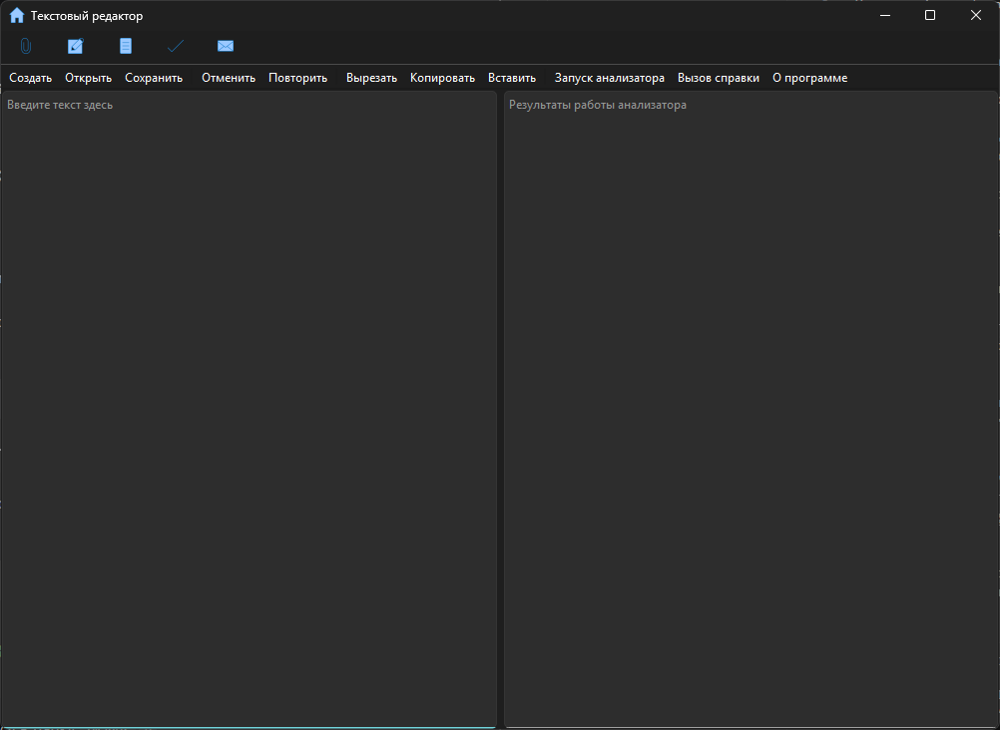
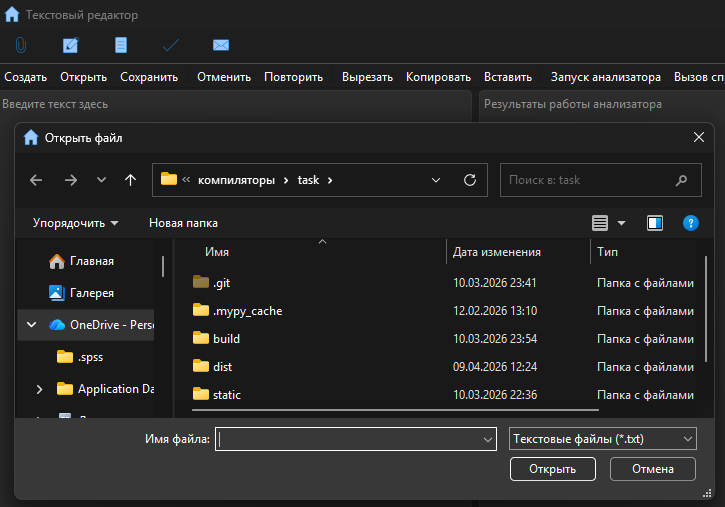
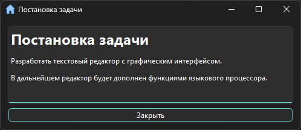
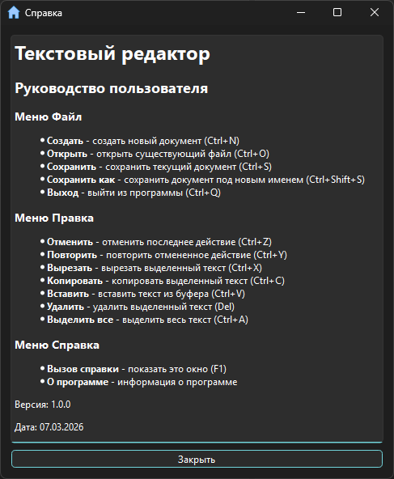
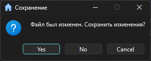

# Проект "Текстовый редактор":

Разработчик: Базыкина Диана, АП-326

Начало работы: Февраль 2026

## Описание проекта:
Текстовый редактор с графическим интерфейсом, разработанный в рамках лабораторных работ.

## Функциональность:
    Меню "Файл": создание, открытие, сохранение файлов, выход
    Меню "Правка": отмена/повтор действий, вырезание, копирование, вставка, удаление, выделение всего текста
    Меню "Справка": вызов справки, информация о программе
    Панель инструментов: быстрый доступ к основным функциям

## Интерфейс:
    Область редактирования текста
    Область вывода результатов
    Изменяемое соотношение размеров областей
    Полосы прокрутки при необходимости

## Технологии:
    Python 3.7 и выше
    PySide6 (Qt for Python)
    VS Code

## Установка и запуск:
Клонировать репозиторий:

    '''git clone https://github.com/dianchik42/text-editor-lab.git

    cd text-editor-lab'''

Установка зависимостей:

    '''pip install -r requirements.txt'''

Запуск:

    '''python main.py'''

## Руководство пользователя:
Главное окно (с меню, областью ввода/редактирования текста, областью отображения результатов):

Открытие файла ("сохранить", "сохранить как"):

Постановка задачи, справка:

Проверка выхода из приложения:

## Лексический анализатор

Диаграмма состояний сканера:

Анализирует каждую лексему, позицию его в коде, сортирует по смысловым группам (код и название группы):

Ошибка при неправильной веденной научной лексемы:

