# Проект «Текстовый редактор»

Разработчик: Базыкина Диана, АП-326.

Начало работы: февраль 2026 года.

## Описание проекта

Текстовый редактор с графическим интерфейсом, разработанный в рамках лабораторных работ. Приложение позволяет работать с текстовыми файлами, выполнять лексический, синтаксический и семантический анализ кода, строить абстрактное синтаксическое дерево (AST), а также искать подстроки с помощью регулярных выражений.

Вариант языкового процессора — «Форматирование числа в научную нотацию на языке Java». В приложении анализируются объявления переменных `double` с числами в научной нотации, например `double x = 1.23e+4;`. Семантический режим также поддерживает использование ранее объявленных переменных. Программа работает с этой учебной конструкцией; выполнение Java-программ и вызовы `String.format` не предусмотрены.

## Функциональность

- Меню «Файл»: создание, открытие, сохранение, сохранение под новым именем и выход.
- Меню «Правка»: отмена и повтор действий, вырезание, копирование, вставка, удаление и выделение всего текста.
- Меню «Текст»: постановка задачи, грамматика и её классификация.
- Меню «Пуск»: лексический анализ, синтаксический анализ, поиск подстрок, семантический анализ и AST.
- Меню «Справка»: руководство пользователя и информация о программе.
- Панель инструментов: быстрый доступ к операциям с текстом и анализаторам.
- Выбор типа поиска: HEX-цвет, юзернейм или пароль.
- Таблица результатов: найденные лексемы, ошибки или совпадения с позициями в тексте.
- Навигация: переход к ошибке и выделение найденной подстроки.
- Панель AST: представление корректных объявлений в JSON.

## Интерфейс

Слева находится область редактирования исходного текста, справа — таблица результатов. В семантическом режиме под таблицей появляется AST. Внизу окна выводятся количество ошибок или совпадений и состояние анализа.

Размеры областей можно менять перетаскиванием разделителя. Для длинного текста и больших результатов предусмотрены полосы прокрутки.

Базовый интерфейс редактора:

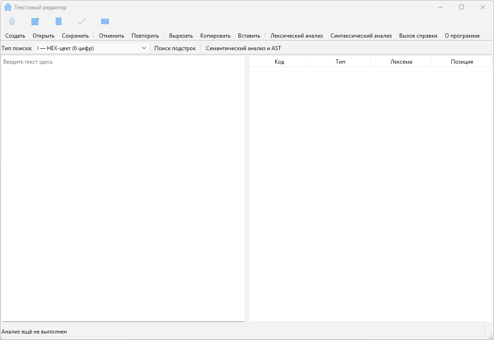

## Технологии

- Python 3.10 и выше.
- PySide6 — графический интерфейс Qt.
- Стандартный модуль `re` — поиск по регулярным выражениям.
- JSON — текстовое представление AST.
- `unittest` — автоматические проверки.

## Установка и запуск

Клонировать репозиторий:

```powershell
git clone https://github.com/dianchik42/text-editor-lab.git
cd text-editor-lab
```

Установить зависимости:

```powershell
py -m pip install -r requirements.txt
```

Запустить приложение:

```powershell
py main.py
```

В средах, где Python запускается командой `python`, использовать её вместо `py`. Все команды выполняются из корня репозитория. Отдельная компиляция не требуется.

## Руководство пользователя

### Работа с файлами и текстом

Создайте документ через «Файл → Создать» или откройте существующий файл через «Файл → Открыть». Файлы читаются и сохраняются в UTF-8. Для записи изменений используйте «Сохранить» или «Сохранить как».

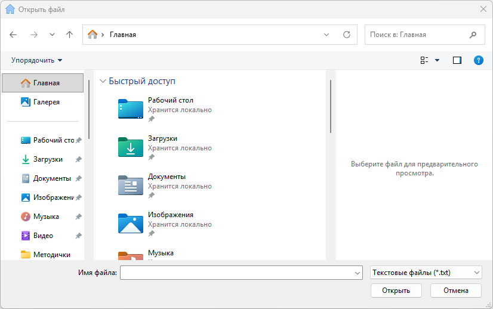

Текст можно редактировать с помощью меню «Правка» и стандартных сочетаний клавиш: Ctrl+Z, Ctrl+C, Ctrl+V, Ctrl+A. Ctrl+N создаёт документ, Ctrl+O открывает файл, Ctrl+S сохраняет изменения.

При закрытии или замене изменённого документа программа предлагает сохранить его:

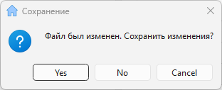

Справка доступна через меню «Справка» или клавишу F1:

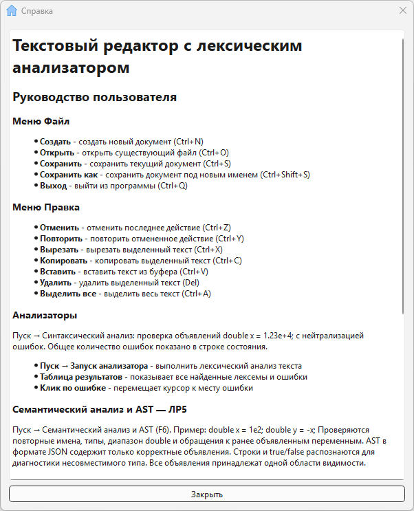

### Запуск анализа

Введите исходный текст и выберите нужную команду в меню «Пуск» или на панели инструментов. Перед каждым запуском предыдущие результаты очищаются. Строки и символы в результатах нумеруются с 1.

| Режим | Входные данные | Выходные данные |
| --- | --- | --- |
| Лексический анализ | Текст из редактора | Лексемы, их типы и позиции; лексические ошибки |
| Синтаксический анализ | Объявления `double` с научными литералами | Таблица ошибок или сообщение о корректном синтаксисе |
| Поиск подстрок | Произвольный текст и выбранный тип поиска | Совпадения, позиции, длины и общий счётчик |
| Семантический анализ и AST | Объявления `double`, включая ссылки на предыдущие переменные | JSON-дерево корректных объявлений и диагностики |

Щёлкните по строке ошибки, чтобы перейти к соответствующему месту в редакторе. В режиме поиска выбор строки выделяет весь найденный фрагмент.

## Лексический анализатор

Запуск: **«Пуск → Лексический анализ»**.

Анализатор выделяет ключевые слова, идентификаторы, десятичные целые и дробные числа, числа в научной нотации, строки, символы, операторы и разделители.

Пример входных данных:

```java
double x = 1.23e+4;
```

Выходные данные — таблица с колонками «Код», «Тип», «Лексема» и «Позиция»:

| Код | Тип | Лексема | Позиция |
| --- | --- | --- | --- |
| 1 | KEYWORD | double | строка 1, [1:6] |
| 2 | IDENTIFIER | x | строка 1, [8:8] |
| 8 | OPERATOR | = | строка 1, [10:10] |
| 5 | SCIENTIFIC | 1.23e+4 | строка 1, [12:18] |
| 9 | DELIMITER | ; | строка 1, [19:19] |

Строка состояния показывает количество лексем и ошибок.

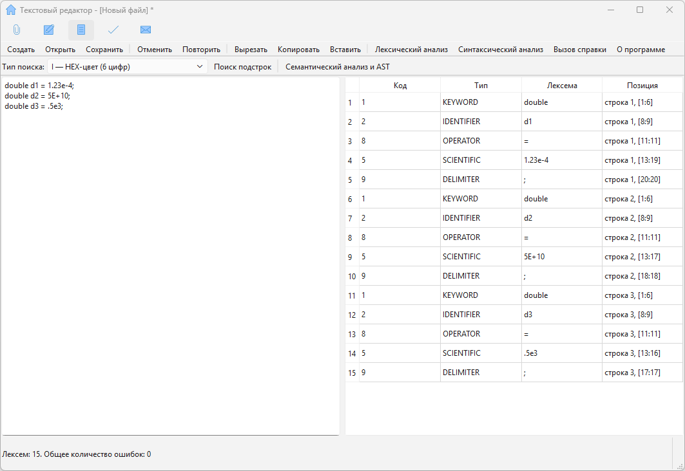

Незавершённый литерал, например `1e+`, отмечается как лексическая ошибка. Щелчок по строке таблицы переводит курсор к неверному фрагменту.

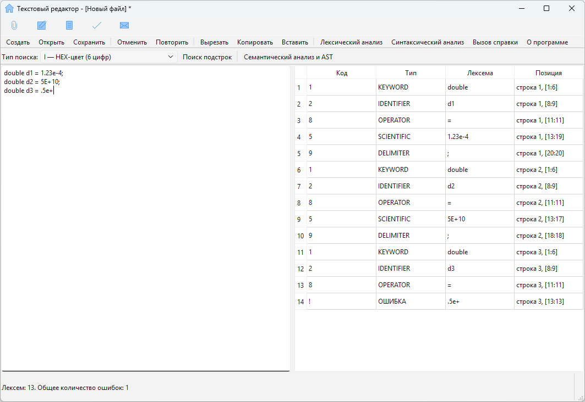

## Синтаксический анализатор

Запуск: **«Пуск → Синтаксический анализ»**.

Сначала выполняется лексический анализ, затем проверяется структура объявления: `double`, имя переменной, `=`, необязательный знак, число с экспонентой `e/E` и `;`.

Корректные входные данные:

```java
double x = 1.23e+4;
double y = -6E-8;
double z = +.5e2;
```

При успешной проверке таблица пуста, а строка состояния содержит сообщение «Синтаксис корректен, ошибок нет».

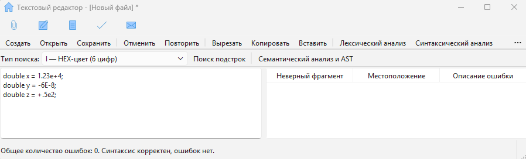

Пример входа с ошибкой:

```java
double x = 1.23;
```

Для выбранного варианта у числа обязательна экспонента. Результат:

| Неверный фрагмент | Местоположение | Описание ошибки |
| --- | --- | --- |
| 1.23 | строка 1, позиция 12 | Ожидалась экспонента e/E и целый показатель степени |

Общее количество ошибок: **1**.

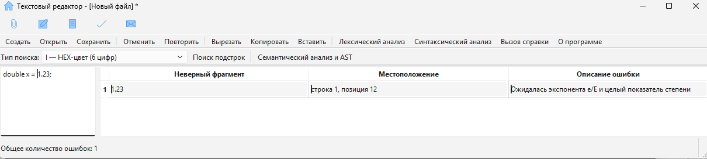

Анализ продолжается после ошибок: восстановление методом Айронса позволяет перейти к допустимому продолжению и проверить следующие объявления. Исходный текст автоматически не изменяется.

Для пустого ввода выводится ошибка «Ожидалось объявление double»:

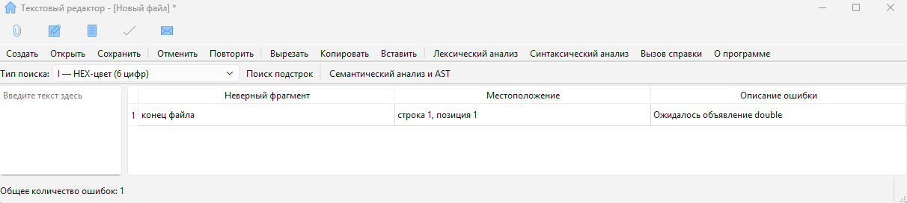

### Грамматика и схема анализа

Синтаксическая грамматика над токенами:

```text
1) ‹Program›     → ‹Declaration› ‹Rest›
2) ‹Rest›        → ‹Declaration› ‹Rest›
3) ‹Rest›        → ε
4) ‹Declaration› → double id = ‹Sign› scientific ;
5) ‹Sign›        → +
6) ‹Sign›        → -
7) ‹Sign›        → ε
```

Начальный символ — ‹Program›. Терминалы: `double`, `id`, `=`, `+`, `-`, `scientific`, `;`. Нетерминалы: ‹Program›, ‹Rest›, ‹Declaration›, ‹Sign›. Здесь `id` и `scientific` — токены идентификатора и научного литерала; ε — пустая цепочка.

Грамматика контекстно-свободная (тип 2): слева каждого правила один нетерминал. В этой записи она не праволинейная, хотя сам язык регулярен и допускает конечный автомат. Реализация использует рекурсивный спуск.

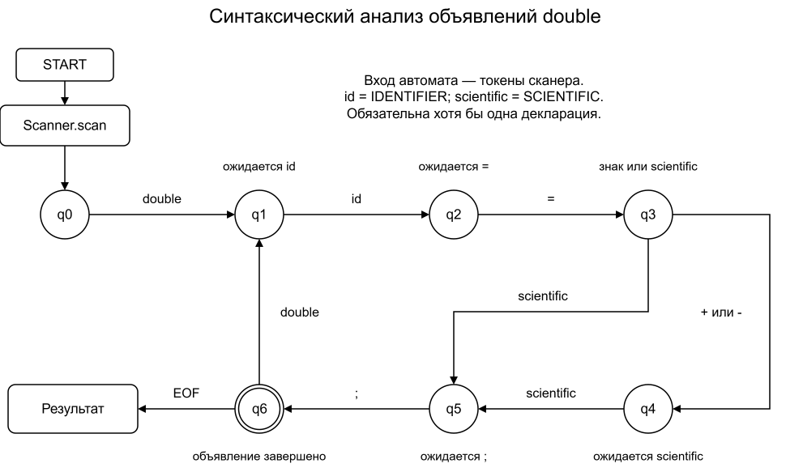

Схема показывает переходы между компонентами объявления: ключевым словом double, идентификатором, знаком присваивания, необязательным знаком числа, научным литералом и точкой с запятой. После завершения объявления анализируется следующее либо формируется результат. При несоответствии выполняются диагностика и восстановление разбора.

[Подробное описание грамматики, классификации и схем синтаксического анализа](docs/syntax-analysis/README.md).

## Поиск подстрок по регулярным выражениям

На панели **«Тип поиска»** выберите один из трёх форматов и нажмите **«Поиск подстрок»**. Эта команда также доступна в меню «Пуск».

Вход — произвольный текст. Выход — таблица с колонками «Найденная подстрока», «Начальная позиция» и «Длина». Строка состояния показывает общее количество совпадений. При выборе строки мышью или клавиатурой соответствующая подстрока подсвечивается в редакторе.

Запись `r"..."` — сырая строка Python; префикс `r` и внешние кавычки не входят в шаблон. Поиск выполняется с учётом регистра, все совпадения извлекаются через `re.finditer`.

[Подробное описание регулярных выражений и примеры совпадений](docs/regex-search/README.md).

### HEX-цвет

Регулярное выражение:

```python
r"(?<![\w#])#?[0-9A-Fa-f]{6}(?!\w)"
```

**Пояснение каждого обозначения:**

- `r"..."` — сырая строка Python: обратные слеши передаются движку регулярных выражений.
- `(?<!...)` — отрицательная проверка символа слева, не включаемого в совпадение.
- `[\w#]` — один буквенно-цифровой символ Unicode, подчёркивание или #. Такая левая граница исключает код внутри слова и повторный префикс ##.
- `#?` — ноль или один символ #; `?` означает необязательность предыдущего элемента.
- `[0-9A-Fa-f]` — одна цифра 0–9 либо латинская буква A–F/a–f; квадратные скобки задают класс символов, дефис — диапазон.
- `{6}` — ровно шесть повторений предыдущего класса.
- `(?!\w)` — отрицательная проверка справа: следующий символ не должен быть буквой, цифрой или подчёркиванием. Это предотвращает извлечение первых шести цифр более длинного кода.


Ищутся коды из шести шестнадцатеричных цифр `0–9`, `A–F`, `a–f`. Префикс `#` необязателен. Если он присутствует, то входит в найденный фрагмент и его длину.

Пример входа:

```text
#A1b2C3 abcdef #12345 #GG0000
```

Результат:

| Найденная подстрока | Начальная позиция | Длина |
| --- | --- | --- |
| #A1b2C3 | строка 1, символ 1 | 7 |
| abcdef | строка 1, символ 9 | 6 |

`#12345` и `#GG0000` не соответствуют формату. Программа также не извлекает шестизначный префикс из более длинного кода.

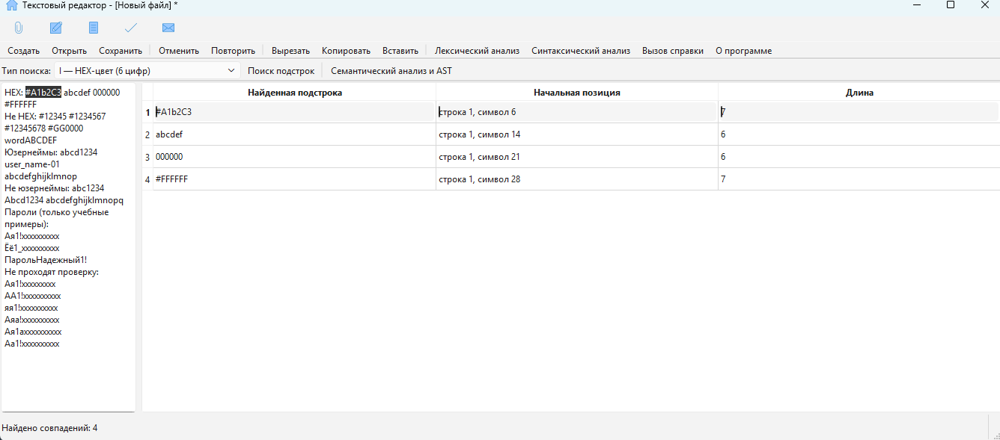

### Юзернейм

Регулярное выражение:

```python
r"(?<![\w-])[a-z0-9_-]{8,16}(?![\w-])"
```

**Пояснение каждого обозначения:**

- `(?<![\w-])` — слева не должно быть символа слова Unicode или дефиса; не позволяет начинать совпадение внутри более длинного имени, включая имя с недопустимой заглавной или русской буквой.
- `[a-z0-9_-]` — один разрешённый символ: строчная латинская буква a–z, цифра 0–9, подчёркивание либо дефис. Дефис в конце класса обозначает сам себя.
- `{8,16}` — от 8 до 16 повторений включительно.
- `(?![\w-])` — справа не должно быть символа слова или дефиса; предотвращает совпадение с префиксом слишком длинного имени.
- `r`, квадратные скобки, `\w` и конструкции проверок имеют те же значения, что в задаче I. Проверки границ не входят в найденную подстроку.


Ищутся имена длиной от 8 до 16 символов: строчные латинские буквы, цифры, дефис и подчёркивание. Наличие всех видов символов одновременно не обязательно.

```text
abcd1234 user_name-01 abcdefghijklmnop
abc1234 Abcd1234 abcdefghijklmnopq
```

Найдутся три имени из первой строки, длиной 8, 12 и 16 символов. Во второй строке примеры не подходят из-за длины либо заглавной буквы. Слишком длинное имя не разбивается на подходящие части.

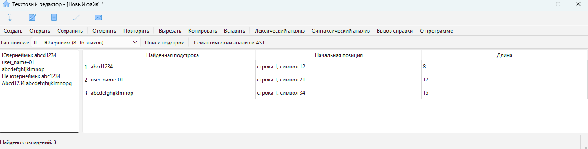

### Пароль по заданным требованиям

Регулярное выражение:

```python
r"(?<!\S)(?=\S*[А-ЯЁ])(?=\S*[а-яё])(?=\S*[0-9])(?=\S*[()#?!|/@$%\\^&*_-])\S{14,}(?!\S)"
```

**Пояснение каждого обозначения:**

- `\S` — любой непробельный символ (противоположность `\s`).
- `(?<!\S)` — слева начало текста или пробельный разделитель, то есть начало целого кандидата.
- `(?=...)` — положительная проверка вперёд; проверяет условие, но не потребляет символы.
- `*` — ноль или больше повторений. `\S*` позволяет искать обязательный символ в любой позиции текущего кандидата, не переходя через пробел или перевод строки.
- `(?=\S*[А-ЯЁ])` — в кандидате есть заглавная русская буква. Ё указана отдельно, поскольку не входит в диапазон А–Я.
- `(?=\S*[а-яё])` — в кандидате есть строчная русская буква; ё указана отдельно.
- `(?=\S*[0-9])` — есть хотя бы одна ASCII-цифра. Использование `[0-9]` вместо `\d` явно исключает цифры других систем письма.
- `(?=\S*[()#?!|/@$%\\^&*_-])` — есть специальный символ из класса. Список реализован буквально: круглые скобки, #, ?, !, вертикальная черта, /, @, $, %, обратная косая черта, ^, &, *, дефис и подчёркивание. Повторяющийся / из условия достаточно указать один раз.
- Внутри класса скобки, `?`, `!`, вертикальная черта, `/`, `@`, `$`, `%`, `&`, `*`, `_` обозначают сами себя; `^` находится не в начале и не означает отрицание. `\\` в сырой строке РВ означает один буквальный обратный слеш. Дефис в конце класса — буквальный дефис.
- `\S{14,}` — потребить не менее 14 непробельных символов, без верхнего ограничения.
- `(?!\S)` — справа пробел или конец текста: нельзя возвращать лишь часть кандидата.

Допускаются другие непробельные символы, в том числе латинские буквы: условие задаёт обязательные категории, а не запрещает остальные символы. Спецсимвол вне списка может присутствовать, но не заменяет обязательный символ из списка.


Ищутся непробельные фрагменты длиной не менее 14 символов, содержащие:

- хотя бы одну заглавную русскую букву, включая Ё;
- хотя бы одну строчную русскую букву, включая ё;
- хотя бы одну цифру `0–9`;
- хотя бы один специальный символ из списка ниже.

```text
( ) # ? ! | / @ $ % \ ^ & * - _
```

Пароли разделяются пробелами, табуляцией или переводами строк. Латинские буквы не заменяют обязательные русские буквы.

Пример входа:

```text
Ая1!xxxxxxxxxx
Ёё1_xxxxxxxxxx
ПарольНадежный1!
Aa1!xxxxxxxxxx
```

Будут найдены первые три строки длиной 14, 14 и 16 символов. Последняя строка не подходит: в ней отсутствуют русские буквы.

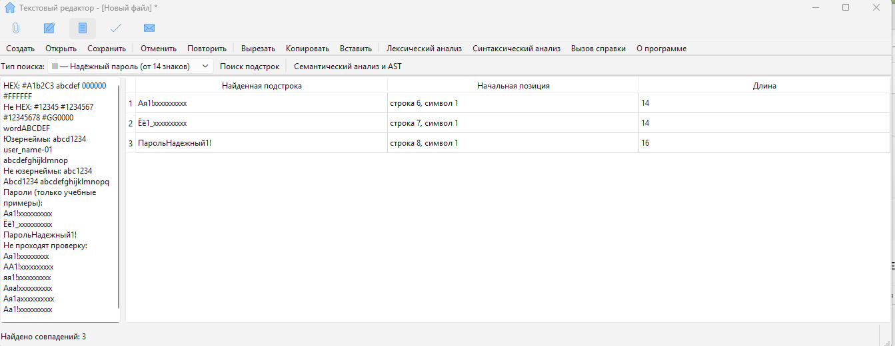

При пустом или пробельном вводе выводится «Нет данных для поиска». Если текст есть, но совпадений нет, счётчик равен 0. После изменения текста или типа поиска таблица и подсветка очищаются; поиск нужно запустить повторно.

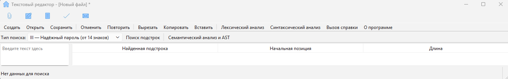

## Семантический анализатор и AST

Запуск: **«Пуск → Семантический анализ и AST»**, одноимённая кнопка панели или **F6**.

Режим проверяет смысловую корректность объявлений и строит AST. В дополнение к научным литералам в инициализаторах разрешены ранее объявленные переменные и унарный знак.

Корректный вход:

```java
double x = 1.23e+4;
double y = -x;
double tiny = 4.9e-324;
```

Результат: ошибок нет, AST содержит три объявления. Значения `x` и `y` равны 12300.0 и −12300.0. Дерево выводится в JSON с типами узлов, атрибутами, дочерними узлами и позициями исходного кода.

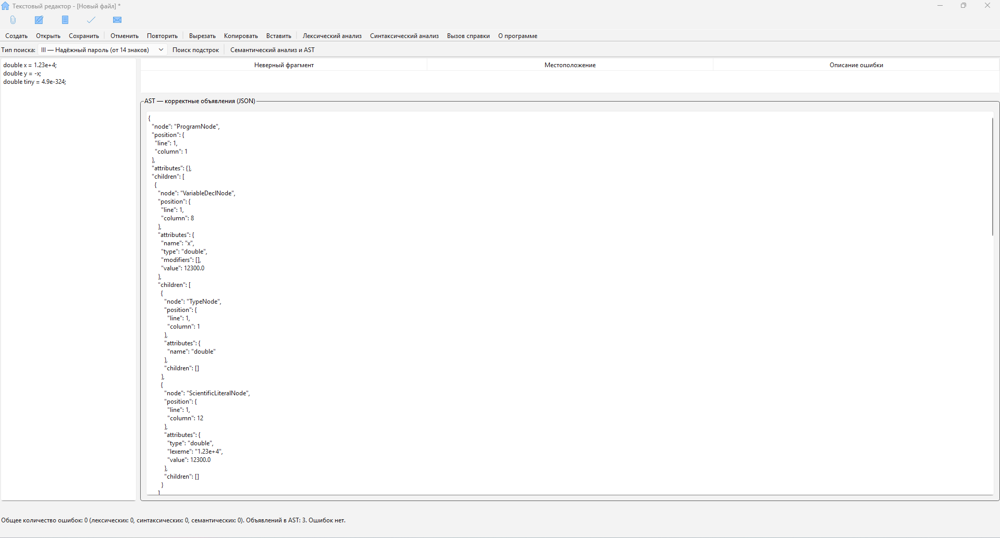

Проверяются четыре условия:

| Проверка | Пример ошибочного входа | Результат |
| --- | --- | --- |
| Уникальность имён | `double x=1e2; double x=2e2;` | Сообщение о повторном объявлении x с указанием первого |
| Совместимость типов | `double x="1e2";` | Ожидался double, получен String |
| Допустимый диапазон | `double x=1e309;` | Переполнение double |
| Использование объявленных имён | `double x=missing;` | Идентификатор missing не объявлен ранее |

Также диагностируется округление ненулевого литерала до нуля, например `1e-324`. Представимые субнормальные значения, такие как `4.9e-324`, допускаются. Значения `true` и `false` распознаются для сообщения о несовместимости типа boolean с double.

Все объявления находятся в одной области видимости и обрабатываются по порядку. Обращение к переменной до её объявления или в собственном инициализаторе считается ошибкой.

Выходные данные:

- таблица лексических, синтаксических и семантических ошибок с позициями;
- общее количество ошибок и разбивка по этапам;
- AST только для корректных объявлений и количество таких объявлений.

Ошибочные объявления не добавляются в таблицу символов и итоговое дерево. При повторном имени сохраняется первое корректное объявление. Анализ последующего кода продолжается.

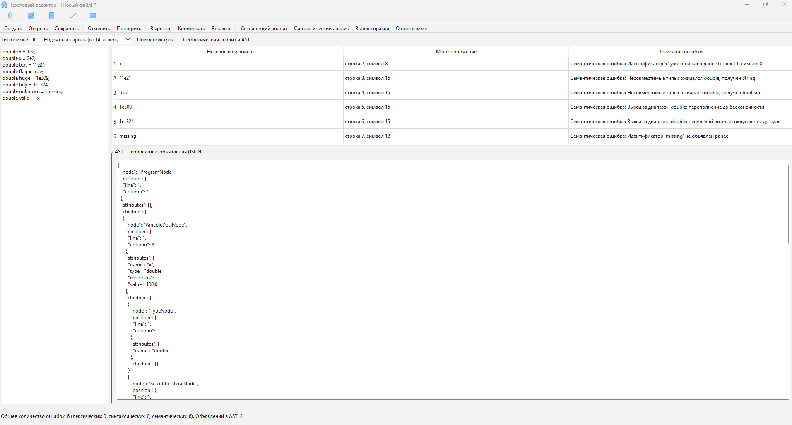

В панели AST можно выделять и копировать JSON. После редактирования исходного текста дерево и результаты очищаются. При переключении на другой режим панель AST скрывается.

## Примеры для проверки

В папке `examples` находятся готовые входные данные:

| Файл | Назначение |
| --- | --- |
| `lab4_search.txt` | Текст для поиска HEX-кодов, юзернеймов и паролей |
| `lab5_valid.txt` | Три корректных объявления для семантического анализа |
| `lab5_errors.txt` | Шесть семантических ошибок; в AST остаются x и valid |

Откройте файл через меню «Файл → Открыть» и запустите соответствующий режим. Поисковые режимы независимы: один фрагмент текста может подходить нескольким форматам.

Автоматические проверки запускаются из корня проекта:

```powershell
py -m unittest -v
```

## Структура проекта

```text
text-editor-lab/
├── main.py                  # Точка запуска
├── requirements.txt         # Зависимости
├── text_editor/
│   ├── compiler/            # Анализаторы, грамматика и AST
│   ├── ui/                  # Графический интерфейс
│   ├── resources/icons/     # Иконки
│   └── regex_search.py      # Поиск по регулярным выражениям
├── tests/                   # Автоматические проверки
├── examples/                # Примеры входных данных
└── images/                  # Иллюстрации README
```
