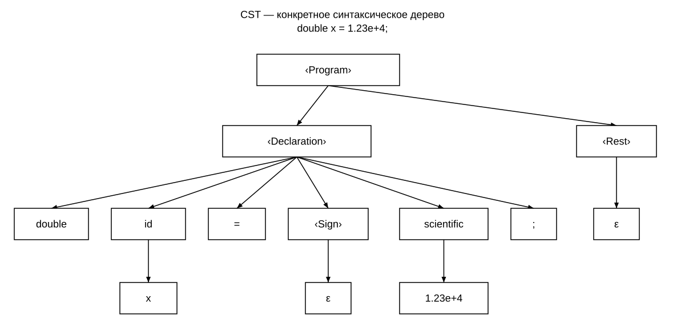
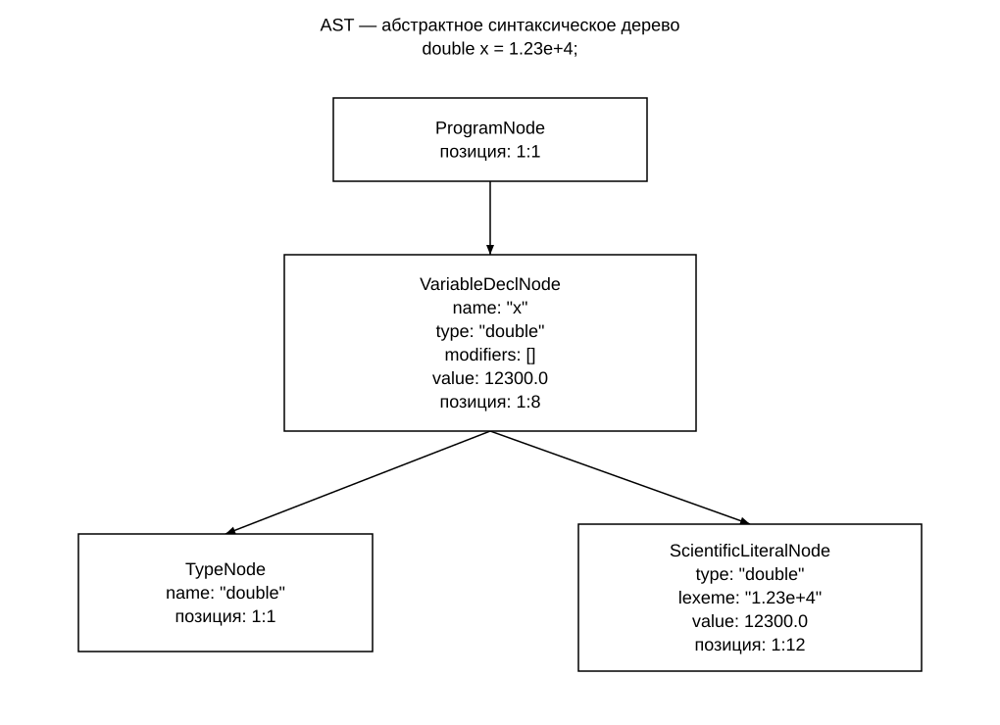

# Пример построения CST и AST

Исходная строка:

```java
double x = 1.23e+4;
```

## Конкретное синтаксическое дерево (CST)



Корень ‹Program› содержит объявление ‹Declaration› и продолжение ‹Rest›. В объявлении сохраняются все компоненты грамматики: double, id, =, ‹Sign›, scientific и ;. Необязательный знак отсутствует, поэтому ‹Sign› выводит ε. Следующих объявлений нет, поэтому ‹Rest› также выводит ε. Под токенами id и scientific указаны их значения — x и 1.23e+4.

## Пример AST

Для строки:

```java
double x = 1.23e+4;
```

AST имеет вид:

```text
ProgramNode
└── VariableDeclNode (name: "x", type: "double", modifiers: [], value: 12300.0)
    ├── TypeNode (name: "double")
    └── ScientificLiteralNode (type: "double", lexeme: "1.23e+4", value: 12300.0)
```

Дочерние узлы показывают структуру дерева, а значения в скобках — атрибуты узлов. ProgramNode содержит одно объявление; у объявления два дочерних узла — тип и инициализатор. Позиции исходного кода для краткости в текстовом примере опущены.



ProgramNode — корень программы. Его дочерний VariableDeclNode представляет объявление переменной x типа double. У объявления два дочерних узла: TypeNode с именем double и ScientificLiteralNode с исходной записью 1.23e+4 и числовым значением 12300.0. Список модификаторов пуст: данная конструкция их не содержит.

На схеме показаны типы узлов, их атрибуты и позиции. Сводные данные:

| Узел | Атрибуты | Позиция (строка:символ) |
| --- | --- | --- |
| ProgramNode | Корень программы, одно объявление | 1:1 |
| VariableDeclNode | name = "x", type = "double", modifiers = [], value = 12300.0 | 1:8 |
| TypeNode | name = "double" | 1:1 |
| ScientificLiteralNode | type = "double", lexeme = "1.23e+4", value = 12300.0 | 1:12 |

В AST нет отдельных узлов для =, ;, ε и вспомогательных правил ‹Rest› и ‹Sign›. Эти элементы нужны при распознавании, но не несут самостоятельного значения для семантических проверок.

Позиции в таблице обозначены как строка:символ, начиная с 1. У объявления позиция имени x — 1:8, у типа double — 1:1, у числового литерала — 1:12. Схема соответствует результату семантического анализатора приложения; [полное представление AST в JSON](example.json) содержит те же узлы, атрибуты и позиции.

## Формат вывода AST

В приложении AST выводится в JSON с отступами. Каждый узел содержит поля `node` (тип узла), `position` (строка и символ), `attributes` (атрибуты) и `children` (дочерние узлы). Текстовое дерево выше представляет те же данные в наглядной форме для описания проекта. В итоговое AST включаются только корректные объявления.

## Результат анализа

Строка корректна: ошибок нет, в таблице символов появляется x со значением 12300.0, а итоговое дерево содержит одно объявление. При повторном объявлении этого имени ошибочное объявление в итоговое AST не добавляется.
