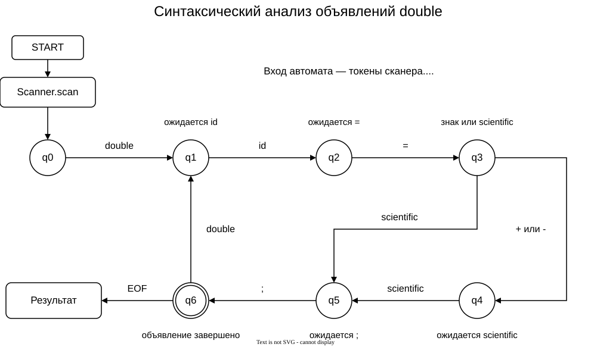

# Грамматика и схема синтаксического анализа

Вариант: «Форматирование числа в научную нотацию на языке Java».

Рассматривается синтаксический режим: одно или несколько объявлений `double` с научным числовым литералом. Например:

```java
double x = 1.23e+4;
double y = -6E-8;
double z = +.5e2;
```

## 1. Разработанная грамматика

Определим грамматику G[‹Program›] в нотации Хомского. Разбор состоит из двух уровней: сканер превращает символы в токены, затем парсер разбирает последовательность токенов. Поэтому `id` и `scientific` в синтаксической грамматике — терминалы (классы токенов), а не отдельные символы исходного текста.

### 1.1. Синтаксические продукции P

```text
1) ‹Program›     → ‹Declaration› ‹Rest›
2) ‹Rest›        → ‹Declaration› ‹Rest›
3) ‹Rest›        → ε
4) ‹Declaration› → double id = ‹Sign› scientific ;
5) ‹Sign›        → +
6) ‹Sign›        → -
7) ‹Sign›        → ε
```

Составляющие грамматики G = (VN, VT, P, Z):

```text
Z  = ‹Program›
VT = {double, id, =, +, -, scientific, ;}
VN = {‹Program›, ‹Rest›, ‹Declaration›, ‹Sign›}
P  = {продукции 1–7}
```

`double` — ключевое слово; `id` — допустимый идентификатор; `scientific` — число с обязательной экспонентой e/E. ε обозначает пустую цепочку, а EOF — конец потока; EOF не входит в VT и не является символом исходного языка. Пустая программа не порождается правилом 1.

Пример вывода на уровне токенов:

```text
‹Program› ⇒ ‹Declaration› ‹Rest›
          ⇒ double id = ‹Sign› scientific ; ‹Rest›
          ⇒ double id = - scientific ; ‹Rest›
          ⇒ double id = - scientific ;
```

Этой цепочке соответствует, например, `double y = -6E-8;`.

### 1.2. Определение лексем

Чтобы не смешивать символы и токены, отдельно зададим вспомогательную грамматику лексем. Её продукции определяют, какие фрагменты сканер относит к `id` и `scientific`:

```text
L1)  ‹Identifier›    → ‹Letter› ‹IdTail› | _ ‹IdTail›
L2)  ‹IdTail›        → ‹Letter› ‹IdTail› | ‹Digit› ‹IdTail› | _ ‹IdTail› | ε
L3)  ‹Scientific›    → ‹Mantissa› ‹ExpMark› ‹ExpSign› ‹Digits›
L4)  ‹Mantissa›      → ‹Digits› ‹Fraction› | . ‹Digits›
L5)  ‹Fraction›      → . ‹OptionalDigits› | ε
L6)  ‹OptionalDigits› → ‹Digits› | ε
L7)  ‹ExpMark›       → e | E
L8)  ‹ExpSign›       → + | - | ε
L9)  ‹Digits›        → ‹Digit› ‹DigitsTail›
L10) ‹DigitsTail›    → ‹Digit› ‹DigitsTail› | ε
L11) ‹Letter›       → a | b | … | z | A | B | … | Z
L12) ‹Digit›        → 0 | 1 | 2 | 3 | 4 | 5 | 6 | 7 | 8 | 9
```

Вспомогательные нетерминалы: {‹Identifier›, ‹IdTail›, ‹Scientific›, ‹Mantissa›, ‹Fraction›, ‹OptionalDigits›, ‹ExpMark›, ‹ExpSign›, ‹Digits›, ‹DigitsTail›, ‹Letter›, ‹Digit›}. Их терминальный алфавит — латинские буквы, цифры и символы `_`, `.`, `+`, `-`. Начальный символ выбирается по проверяемой лексеме: ‹Identifier› или ‹Scientific›. Многоточия в L11 означают перечисление всех букв соответствующего диапазона.

`id` соответствует ‹Identifier›, за исключением ключевых слов Java из KEYWORDS, а также true, false и null. `scientific` соответствует ‹Scientific›. Знак перед мантиссой — отдельный токен, знак после e/E входит в научный литерал. Пробелы допустимы между токенами; внутри имени и числа они запрещены. Эти условия разделения лексем обеспечивает Scanner.scan.

Примеры научных литералов: `1e2`, `1.23e+4`, `1.e0`, `.5E-2`. Цепочки `1.23`, `1e`, `1e+` не являются scientific.

## 2. Классификация грамматики

По классификации Хомского представленная синтаксическая грамматика G[‹Program›] является **контекстно-свободной (тип 2)**: левая часть каждой продукции состоит ровно из одного нетерминала, а правая — из терминалов и/или нетерминалов либо ε. Контекст применения правила не задаётся.

В данной записи грамматика **не является автоматной (праволинейной, тип 3)**. В продукциях 1 и 2 справа находятся два нетерминала, а в продукции 4 после нетерминала ‹Sign› следуют терминалы. Это не форма A → aB, A → a или A → ε. Правило ‹Rest› → ‹Declaration› ‹Rest› праворекурсивно, но одной правой рекурсии недостаточно для признания грамматики праволинейной.

Грамматика также не является S-грамматикой в строгом смысле: есть ε-продукции, а правила 1 и 2 начинаются с нетерминала. Причина контекстно-свободности — форма **левой**, а не правой части правил.

При этом **порождаемый язык регулярен**: объявления не вложены и имеют фиксированную структуру с необязательным знаком. Для него существует эквивалентный конечный автомат, представленный ниже. Регулярность языка не делает выбранную запись грамматики автоматически праволинейной.

Синтаксическая грамматика LL(1): для ‹Sign› выбирается +, - или ε перед scientific; для ‹Rest› — новое объявление при double либо ε при EOF. Это утверждение относится к уровню токенов, а не к неразделённому потоку символов.

## 3. Схема метода анализа

В реализации используется рекурсивный спуск: parse_program соответствует ‹Program› и повторению ‹Rest›, parse_statement — ‹Declaration›, а expect проверяет обязательный компонент. Два рисунка описывают правильный разбор и обработку несоответствий. Схема относится к синтаксическому режиму; расширения семантического режима здесь не рассматриваются.

### 3.1. Переходы по токенам


| Состояние | Ожидаемое продолжение |
| --- | --- |
| q0 | double — начало первого объявления |
| q1 | id — имя переменной |
| q2 | = — присваивание |
| q3 | +, - или scientific — начало значения |
| q4 | scientific — число после знака |
| q5 | ; — конец объявления |
| q6 | double — следующее объявление, либо EOF — конец программы |

Начальное состояние — q0, принимающее — q6. Из q3 можно перейти сразу в q5 по scientific: так реализуется ε-альтернатива ‹Sign›. EOF в q0 означает ошибку пустой программы, а в q1–q5 — незавершённое объявление. Любой переход, не показанный на схеме, означает ошибку и обращение к механизму восстановления. Наличие диагностики не отменяется тем, что после восстановления автомат дошёл до конца.

Трасса для `double y = -6E-8;`:

```text
q0 —double→ q1 —id→ q2 —=→ q3 —-→ q4 —scientific→ q5 —;→ q6 —EOF→ результат
```

Цикл q6 —double→ q1 реализует повторение объявлений. Успешная цепочка `double x=1e2; double y=2e3;` проходит этот цикл один раз.

### 3.2. Несоответствие и восстановление



При несоответствии expect регистрирует позицию и описание, затем ищет ожидаемый токен или допустимую границу продолжения. Если найден ожидаемый токен, он потребляется и разбор продолжается. Если найдена граница, текущий обязательный компонент считается пропущенным, а граничный токен сохраняется для следующего шага. При EOF управление возвращается вызывающему правилу, не потребляя вход.

Контекстные множества синхронизации из реализации (это расширения для восстановления, не только формальные множества FOLLOW):

| Ожидаемый компонент | Границы, при которых поиск останавливается без потребления токена |
| --- | --- |
| double | IDENTIFIER, =, +, -, числовой токен, ; |
| id | =, +, -, числовой токен, ;, double |
| = | +, -, числовой токен, ;, double |
| scientific | ;, double |
| ; | double, IDENTIFIER |

Числовые токены при восстановлении включают INTEGER, FLOAT, SCIENTIFIC и UNKNOWN. INTEGER/FLOAT потребляются с диагностикой отсутствующей экспоненты; UNKNOWN уже содержит лексическую ошибку и не получает повторной диагностики той же лексемы. Поэтому граф правильного разбора принимает только scientific, а поведение на повреждённом входе показано на схеме нейтрализации ошибок.

Конец файла не означает безусловного успеха: итог определяется накопленным списком ошибок. Например, для `double x=1.23;` получаем одну ошибку у `1.23`, затем анализ доходит до `;` и заканчивается с ненулевым счётчиком. После первого несоответствия исходный текст продолжает анализироваться и не исправляется автоматически.
